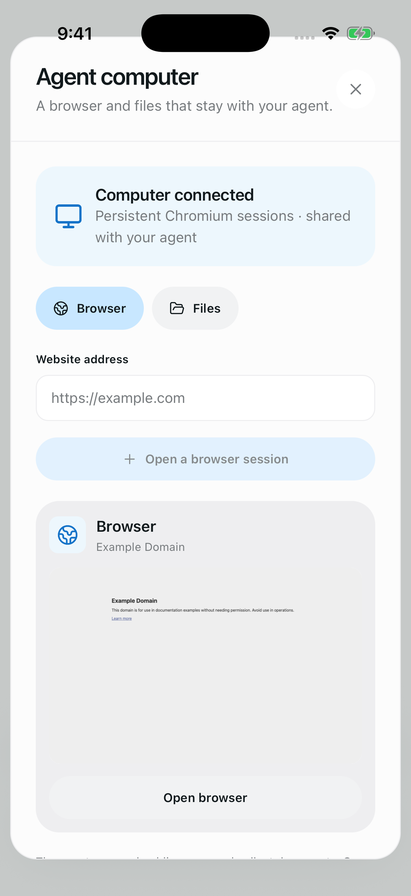
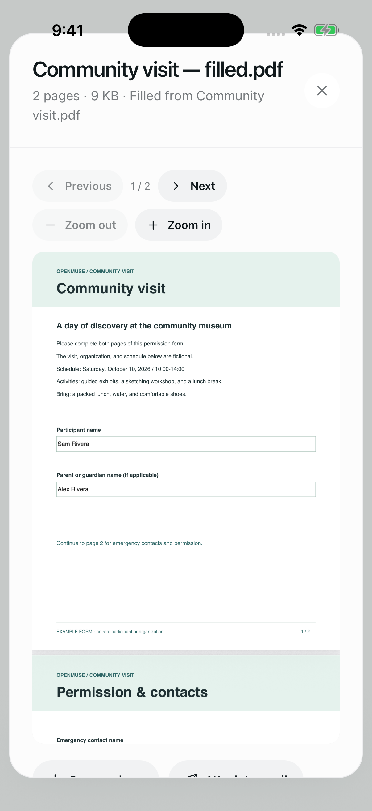
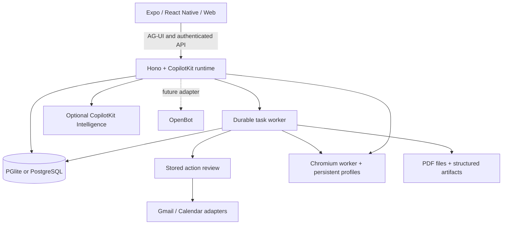

<div align="center">

# OpenMuse

**A personal agent with a browser, files, and work that keeps going.**

Ask for an outcome. Follow the plan, review actions, and come back to the result.
Built with CopilotKit React Native for iOS, Android, and web.

[Quick start](#quick-start) · [Demo](#demo) · [Features](#features) · [Architecture](#architecture) · [Docs](docs/README.md) · [Contributing](CONTRIBUTING.md)

[](https://github.com/jerelvelarde/openmuse/actions/workflows/ci.yml)
[](LICENSE)

</div>

> **Alpha, for self-hosting and building on.** The default runs locally with fictional data and no API keys. Open-ended reasoning, live Google accounts, and CopilotKit Rich Threads require their own configuration. See [what is verified](docs/VERIFICATION.md) and the [roadmap](ROADMAP.md).

## Demo

[**Watch the native iPhone walkthrough**](https://github.com/jerelvelarde/openmuse/releases/download/v0.1.0-alpha/openmuse-demo.mp4)

<a href="https://github.com/jerelvelarde/openmuse/releases/download/v0.1.0-alpha/openmuse-demo.mp4"></a>
<a href="https://github.com/jerelvelarde/openmuse/releases/download/v0.1.0-alpha/openmuse-demo.mp4"></a>

Actual app capture with fictional mail, a generated PDF, saved tasks, a finance artifact, goals, and a real Chromium browser. Edited for pace; no simulated provider connections. [Recording details and reproduction](docs/DEMO.md).

## What it is

OpenMuse is a personal-agent application inspired by Meta Muse and patterned after [OpenBot](https://github.com/CopilotKit/OpenBot)'s emphasis on an agent's computer, visible work, and rich results. It runs its own server, task worker, and browser worker. You can inspect and change the source under the MIT license.

The current computer is **persistent Chromium plus documents**. The agent can read public pages and collect PDFs; you can open the same browser session and interact with it. Full desktop VMs and autonomous checkout are future work.

## Features

| Surface | What runs in this alpha |
| --- | --- |
| **Chat** | CopilotKit headless chat with streamed AG-UI events, delegated tasks, and inline browser, PDF, plan, and finance cards. |
| **Agent computer** | Persistent browser profiles, real screenshots, interactive console, public-page reads, PDF downloads, and files. |
| **Activity** | Durable task plans, progress, input requests, pause/resume/cancel/retry, approvals, and saved receipts. SQL leases recover interrupted work. |
| **Ideas** | Suggestions with source evidence; edit, accept, or dismiss. Sent replies and completed matching work are excluded. |
| **Goals & Tracking** | Goals and milestones; recurring public-page checks for changes, text availability, or USD price thresholds, with deduplicated alerts and failure backoff. |
| **Documents** | Email attachment → PDF → requested form values → filled copy → reviewed reply → receipt. Native/web PDF viewing, paging, zoom, supported fields, and sharing. |
| **Finance** | Import transaction CSV to create a spending summary with categories, transactions, and a savings-goal action. |
| **Gmail & Calendar** | Google OAuth adapters, complete mail threads, drafts/attachments, calendar discovery, and reviewed event creation/update/deletion. Live credentials required. |
| **Personal context** | Editable agent identity and memories you can inspect, update, and forget. Durable in-app notifications. |
| **Rich Threads** | Optional CopilotKit Intelligence persistence with native thread listing, switching, renaming, archiving, restoring, and replay. A project key is required; live acceptance is pending. |

The [feature inventory](docs/FEATURES.md) maps the Muse references to the implementation. Health/bank/social connectors, device push, voice, generated executable tools, and automatic reservations/payments are on the [roadmap](ROADMAP.md).

## Quick start

**Requirements:** Node 24 LTS and pnpm 11.19.0. The sample app needs no model, Google account, Docker, or Intelligence subscription.

```sh
git clone https://github.com/jerelvelarde/openmuse.git
cd openmuse
pnpm install --frozen-lockfile
cp .env.example .env
pnpm dev
```

In another terminal:

```sh
pnpm dev:web
```

Open [localhost:8081](http://localhost:8081). The API runs at [localhost:8787/api/health](http://localhost:8787/api/health).

### Try it

1. In Chat, send **“Complete the permission slip”**. Open the task, supply fictional form values, inspect the saved PDF, and review the sample reply. This writes only to the local sample mailbox.
2. In **Goals → Track**, create a built-in availability watch, then change the sample page to trigger an alert.
3. In **Menu → Delegate task → Finance**, use **Try example transactions** to create an interactive spending tracker.
4. Start the [browser worker](#browser-worker), then open **Computer** and navigate to `https://example.com`.

For iOS or Android, use `pnpm --dir apps/mobile ios` or `pnpm --dir apps/mobile android`. Xcode or Android tooling is required. The PDF reader needs an Expo development build; use [native setup](apps/mobile/README.md).

## Configure the agent and Google

Copy the commented settings in [.env.example](.env.example) into your private `.env`:

1. Set `AGENT_BACKEND=model`, `MODEL=provider/model-id`, and the matching provider key. CopilotKit supports the configured OpenAI, Anthropic or Google provider. Sample data can still be used with a real model. Provider keys stay on the server.
2. For personal mail/calendar, set `WORKSPACE_MODE=live`, a random `OPENMUSE_ACCESS_KEY` of at least 24 characters, and `TOKEN_ENCRYPTION_KEY` containing 32 random bytes encoded as base64. Restart the API.
3. Configure a Google OAuth web client with Gmail and Calendar APIs enabled. Set `GOOGLE_CLIENT_ID` and `GOOGLE_CLIENT_SECRET`; register `${PUBLIC_API_URL}/api/google/callback` as its redirect URI. Configure consent/test-user access in your Google project.
4. Open **Apps → Gmail** (or **Google Calendar**), connect read access, and grant write access when needed. Every send or calendar change still requires its own stored review. Changing/disconnecting the account invalidates pending connection-bound work.

Google credentials are encrypted at rest. File URLs and browser consoles use short-lived signatures. This deployment uses one owner protected by a shared access key; it is not a multi-tenant authentication system. Use HTTPS and restricted network access for a remote host. Do not expose sample mode beyond loopback.

## Browser worker

Set `BROWSER_WORKER_URL=http://127.0.0.1:8790` and a random `WORKER_TOKEN` of at least 32 characters in `.env`.

```sh
pnpm --dir apps/worker exec playwright install chromium
pnpm dev:browser
```

Or use `docker compose --env-file .env -f infra/compose.yaml up --build -d`. The same token must reach the API and worker. Sessions have persistent Chromium profiles; the app can open a live screenshot console and import PDF downloads. Agent tools can read public pages and hand interactive work to the person. [Worker setup and boundaries](apps/worker/README.md).

## Persistence and operation

By default, embedded PGlite, documents and the signing key live in `.openmuse/`; browser profiles live in `.openmuse/browser-profiles/`. Keep that directory private and back it up. The API hosts the task worker. The host must remain running for background work.

For a separate task worker, configure the same `DATABASE_URL`, secrets and shared `DATA_DIR` for both processes, then set `TASK_WORKER_ENABLED=false` on the API and run `pnpm dev:worker`. PGlite cannot be opened by separate processes. Production commands are `pnpm build:server`, `pnpm start` and `pnpm start:worker`. Run one API instance; task workers coordinate through SQL leases.

No hidden retry occurs after an uncertain external write. Review its provider outcome before creating a replacement. Pausing/cancelling prevents subsequent task steps; an already approved in-flight provider request may finish.

## CopilotKit Rich Threads

Set `CPK_INTELLIGENCE_API_KEY` on the server and restart it to use CopilotKit Intelligence for conversation persistence and replay. The native menu uses `useThreads`; rich tool results link back to saved tasks, documents, and browser sessions. The default keeps one conversation in your local database.

Intelligence is a separate service and is not included in this repository's MIT license. No project key is shipped. [Configuration and validation boundaries](docs/RICH-THREADS.md).

## Architecture



| Directory | Purpose |
| --- | --- |
| `apps/mobile` | Shared iOS, Android, and web UI with CopilotKit headless hooks. |
| `apps/server` | API, CopilotKit runtime, identity boundary, task engine, reviews, files, and persistence. |
| `apps/worker` | Token-protected Playwright browser service with persistent profiles. |
| `packages/domain` | Shared types and request validation. |
| `packages/integrations` | Google and browser protocol adapters. |
| `packages/backends` | Optional OpenBot HTTP adapter and its identity boundary. |
| `tests` | Workflow, runtime, persistence, provider-contract, and authorization tests. |

### OpenBot compatibility

OpenMuse's native client and personal-agent workflows are independent of OpenBot. The disabled OpenBot adapter is pinned and contract-tested against upstream interfaces. Live user/session bridging, routine mapping, and computer backend wiring remain future work. OpenBot's Intelligence runtime is not a raw AG-UI endpoint. [Integration contract](docs/OPENBOT-INTEGRATION.md).

## Development

```sh
pnpm lint
pnpm typecheck
pnpm test
pnpm build:server
pnpm build:web
pnpm build:ios
pnpm build:android
pnpm --dir apps/worker typecheck
pnpm test:browser
```

Platform build scripts export JavaScript/Hermes bundles; they do not produce signed app binaries. Browser checks require installed Chromium and public fixture access. CI also exercises the browser container. See [contribution guidance](CONTRIBUTING.md) and [verification results](docs/VERIFICATION.md).

## Contributing and license

Issues and pull requests are welcome. Start with [CONTRIBUTING.md](CONTRIBUTING.md), [ROADMAP.md](ROADMAP.md), and the [security policy](SECURITY.md).

MIT licensed. OpenMuse is independent of Meta and is not an official CopilotKit product. Its original interface and sample assets are included; Meta's screenshots and mascot are not redistributed. Website, email, and document content supplies evidence, not permission to act.
